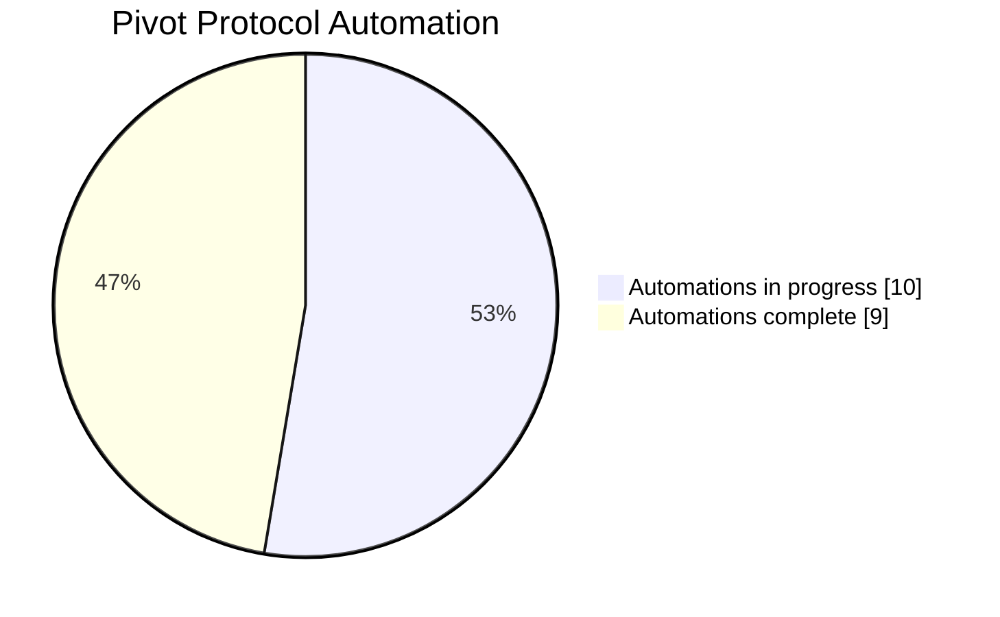
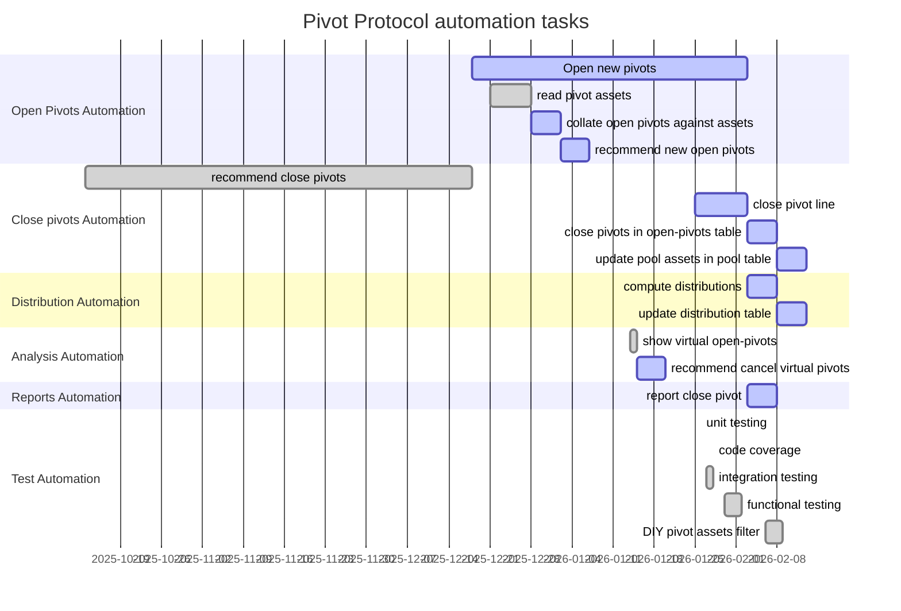

# Pivot Protocol infrastructure

Infrastructure for pivot arbitrage, staking, and distribution on the Pivot protocol

## Applications

* [dapps](dapps) Set of gradually evolving applications for protocol workflow

## Libraries

* [libs](libs): Pivot-specific locations and library modules
functions

## Quizzes

* [quizzes](quizzes): builds dapps of the protocol stepwise via a series 
of quizzes

## Automation tasks

| Task                               | Id    | Depends on | Group    | Dapp      | Ots   | Status | Started    | Released    | Duration |
| :--------------------------------- | :---- | :--------- | :------- | :-------- | :---- | :----- | :--------- | :---------- | :------- |
| Read token quotes                  | 1     |            | quotes   | gecko     | FALSE | ✅      | 2024-06-10 | 2024-09-24  | 106      |
| Open new pivots                    | 2     | 3;7;14     | open     |           | FALSE | ...    | 2025-12-18 | in progress | 47       |
| read pivot assets                  | 3     |            | open     | assets    | FALSE | ✅      | 2025-12-21 | 2025-12-28  | 7        |
| collate open pivots against assets | 4     | 3          | open     |           | FALSE | ...    | tbd        |             | 5        |
| recommend new open pivots          | 5     | 4          | open     |           | FALSE | ...    | tbd        |             | 5        |
| recommend close pivots             | 6     | 3          | close    | dusk      | FALSE | ✅      | 2025-10-13 | 2025-12-18  | 66       |
| close pivot line                   | 7     | 6          | close    |           | FALSE | ...    | 2026-01-25 | in progress | 9        |
| integration testing                | 8     |            | tests    | itr       | FALSE | ✅      | 2026-01-27 | 2026-01-28  | 1        |
| functional testing                 | 9     |            | tests    |           | FALSE | ✅      | 2026-01-30 | 2026-02-02  | 3        |
| close pivots in open-pivots table  | 10    | 7          | close    |           | FALSE | ...    | tbd        |             | 5        |
| update pool assets in pool table   | 11    | 10         | close    |           | FALSE | ...    | tbd        |             | 5        |
| compute distributions              | 12    | 7          | dists    |           | FALSE | ...    | tbd        |             | 5        |
| update distribution table          | 13    | 12         | dists    |           | FALSE | ...    | tbd        |             | 5        |
| show virtual open-pivots           | 14    | 3          | analysis | virtsz    | FALSE | ✅      | 2026-01-14 | 2026-01-15  | 1        |
| recommend cancel virtual pivots    | 15    | 14         | analysis |           | FALSE | ...    | tbd        |             | 5        |
| DIY pivot assets filter            | 19    |            | analysis | pools     | FALSE | ✅      | 2026-02-06 | 2026-02-09  | 3        |
| report close pivot                 | 16    | 7          | reports  |           | FALSE | ...    | tbd        |             | 5        |
| unit testing                       | 17    |            | tests    | cfg       | TRUE  | ✅      | 2026-01-26 | 2026-01-26  | 0        |
| code coverage                      | 18    |            | tests    | tarpaulin | TRUE  | ✅      | 2026-01-28 | 2026-01-28  | 0        |

