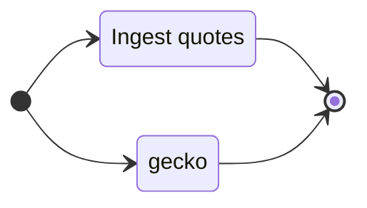

# Automation Workflow

The daily workflow for Pivot protocol can be viewed as phasal.

# dapps

Applications for protocol workflow

## `dusk`: close pivots

* [dusk](dusk): aggregates assets to pivot by blockchain

... and its evolution:

* [chihuahua](chihuahua): close recommendations on one pivot pool
* [basset](basset): close-pivot recommendations condensed to one trade per asset
* [phound / hound](hound): close pivots for all pivot pools

## `dawn`: open pivots

... very much a WIP

* [dawn](dawn): the start of a start, reading pivot pool assets

Standalone dapps that also support `dawn` include:

### `assets`: state of all pools

* [assets](assets): partitions pools by TVL

### `virtsz`: Assets committed to virtual pivots

* [virtsz](virtsz)

### `itr`: Integration tester

Iterates `cargo build` over each subdir in `<dir>`

* [itr](itr)

