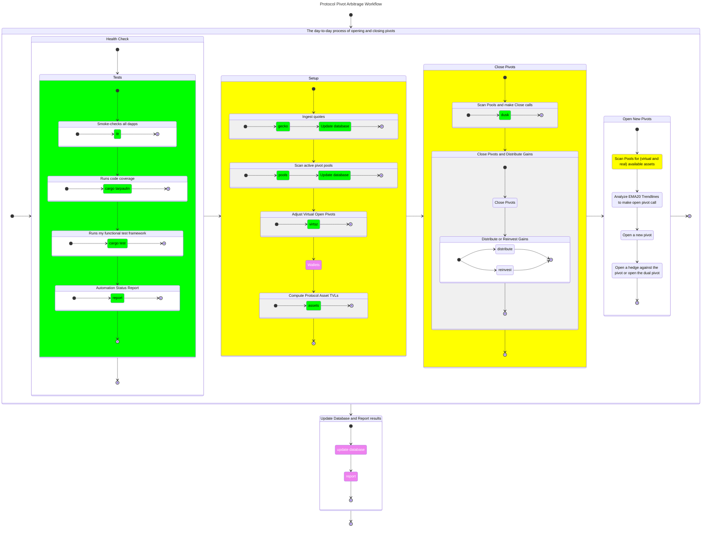

# Automation Workflow

The daily workflow for Pivot protocol can be viewed as phasal.

```mermaid
---
title: Protocol Pivot Arbitrage Workflow
---
stateDiagram-v2
   classDef inUse fill:lime,color:black
   classDef wip fill:yellow,color:black
   classDef manual fill:violet,color:white
   classDef notYet fill:black,color:white

   class Tarp inUse
   class Run inUse
   class itr inUse
   class gecko inUse
   class dusk inUse
   class virtsz inUse
   class pools inUse

   class Tests isUse
   class Integration inUse
   class Setup wip
   class Closes wip
   class WorkFlow wip

   class report manual
   class ReportwithoutUpdatingDatabase inUse
   class ScanOpens wip
   class UpdateDb manual
   class UpdateDbwithoutReporting1 inUse
   class UpdateDbwithoutReporting2 inUse

   class Wallets manual
   class assets inUse

   [*] --> Workflow
   Workflow --> Finalize
   Finalize --> [*]

   Workflow: The day-to-day process of opening and closing pivots
   state Workflow {
      direction LR

      [*] --> Tests
      Tests --> Setup
      Setup --> Closes
      Closes --> Opens
      Opens --> [*]
   }

   Finalize: Update Database and Report results
   state Finalize {
      [*] --> UpdateDb
      UpdateDb --> report 
      report --> [*]

      UpdateDb: update database
   }

   Tests: Health Check
   state Tests {
      [*] --> Integration
      Integration --> [*]

      Integration: Tests
      state Integration {
         [*] --> Itr
         Itr --> Tarpaulin
         Tarpaulin --> Func
         Func --> Rep
         Rep --> [*]
         Itr: Smoke-checks all dapps
         state Itr {
            direction LR

            [*] --> itr
            itr --> [*]
         }
         Tarpaulin: Runs code coverage
         state Tarpaulin {
            direction LR

            [*] --> Tarp
            Tarp --> [*]

            Tarp: cargo tarpaulin
         }
         Func: Runs my functional test framework
         state Func {
            direction LR

            [*] --> Run
            Run --> [*]

            Run: cargo test
         }
         Rep: Automation Status Report
         state Rep {
            direction LR

            [*] --> ReportwithoutUpdatingDatabase
            ReportwithoutUpdatingDatabase --> [*]

            ReportwithoutUpdatingDatabase: report
         }
      }
   }

   Setup: Setup
   state Setup {
      [*] --> Quotes
      Quotes --> Pools
      Pools --> AdjustVirtualPivots
      AdjustVirtualPivots --> Wallets
      Wallets --> Assets
      Assets --> [*]

      Quotes: Ingest quotes
      state Quotes {
            direction LR

         [*] --> gecko
         gecko --> UpdateDbwithoutReporting2
         UpdateDbwithoutReporting2 --> [*]

         UpdateDbwithoutReporting2: Update database
      }

      Pools: Scan active pivot pools
      state Pools {
            direction LR

         [*] --> pools
         pools --> UpdateDbwithoutReporting1
         UpdateDbwithoutReporting1 --> [*]

         UpdateDbwithoutReporting1: Update database
      }

      AdjustVirtualPivots: Adjust Virtual Open Pivots
      state AdjustVirtualPivots {
            direction LR

            [*] --> virtsz
            virtsz --> [*]
      }

      Assets: Compute Protocol Asset TVLs
      state Assets {
         direction LR

         [*] --> assets
         assets --> [*]
      }
   }

   Closes: Close Pivots
   state Closes {
      [*] --> ScanCloses
      ScanCloses --> CloseAndDistribute
      CloseAndDistribute --> [*]

      ScanCloses: Scan Pools and make Close calls
      state ScanCloses {
         direction LR

         [*] --> dusk
         dusk --> [*]
      }

      CloseAndDistribute: Close Pivots and Distribute Gains
      state CloseAndDistribute {
         [*] --> Close
         Close --> Distribute
         Distribute --> [*]

         Close: Close Pivots

         Distribute: Distribute or Reinvest Gains
         state Distribute {
            direction LR

            [*] --> distribute
            distribute --> [*]
            [*] --> reinvest
            reinvest --> [*]
         }
      }
   }

   Opens: Open New Pivots
   state Opens {
      [*] --> ScanOpens
      ScanOpens --> Call
      Call --> Open
      Open --> OpenOrHedge
      OpenOrHedge --> [*]

      ScanOpens: Scan Pools for (virtual and real) available assets
      Call: Analyze EMA20 Trendlines to make open pivot call
      Open: Open a new pivot
      OpenOrHedge: Open a hedge against the pivot or open the dual pivot
   }
```

Each phase is subdivided into states. State colors mean:

* green: automated
* yellow: wip
* violet: manual
* black: not yet implemented

# dapps

Applications for protocol workflow

## Integration Testing

### `itr`: Integration tester

Iterates `cargo build` over each subdir in `<dir>`

* [itr](itr)

## Released

* [dusk](dusk): aggregates assets to pivot by blockchain
* [wyrd](wyrd): closes a pivot based upon a transaction
* [assets](assets): partitions pools by TVL
* [virtsz](virtsz): Assets committed to virtual pivots
* [hwaet](hwaet): Assesses pivot pools health
* [convcls](convcls): Updates old-style close pivot tables
* [quotes](quotes): output today's quotes as JSON

## WIP / Works in Progress

## `dawn`: open pivots

* [dawn](dawn): the start of a start, reading pivot pool assets
  * ... very much a WIP

## Archived

### Evolution of `dusk`

* [pools](archived/pools): lists active pools; superceded by hwaet
* [chihuahua](archived/chihuahua): close recommendations on one pivot pool
* [basset](archived/basset): close-pivot recommendations condensed to one 
trade per asset
* hound: close pivots for all pivot pools. *OBE*: First attempt using github.

