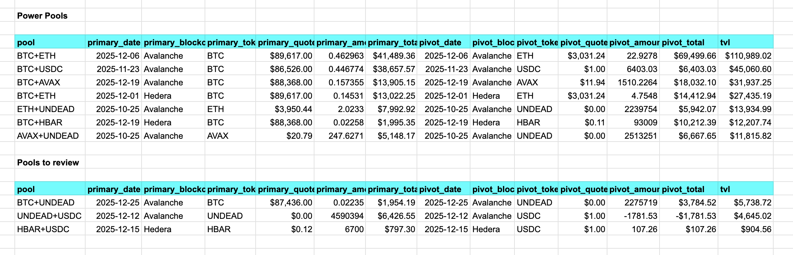

# `assets`

Snapshot of the protocol's pivot pools. Partitions pools by TVL

[source](../../quizzes/quiz06/b_pools/src/main.rs)

## History

* 1.02, 2025-12-28: totalling partitioned- and all pivot pools' assets
* 1.01, 2025-12-28: refactored `min_default` to a function
* 1.00, 2025-12-28: released

