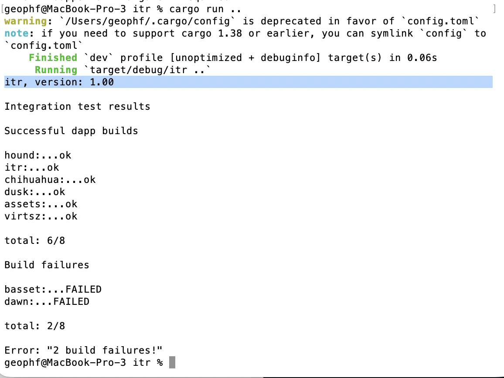

# itr

Integration test-suite that runs `cargo build` over each sub-directory in
`<dir>` and reports build success.

[src](../../quizzes/src/quiz09/a_itr/mod.rs)

-----

## Revisions

* 1.02, 2026-07-05: clap to process arguments and for usage-documentation
* 1.01, 2026-05-06: using new functional test framework
* 1.00, 2026-01-28: released!

