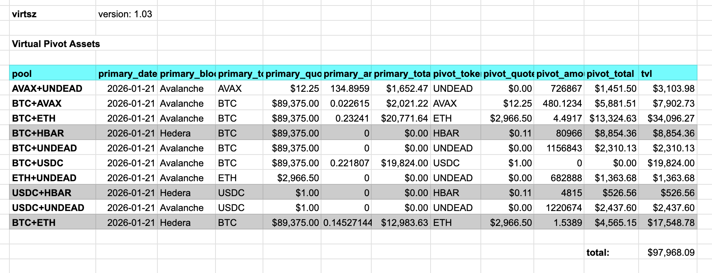

# `virtsz`

Show assets committed to virtual pivots.

* [source](../../quizzes/quiz07/b_virtual/src/main.rs)

## Revisions

* 1.04, 2026-01-21: moved aggregate virtual computation to libs::virtuals
* 1.03, 2026-01-21: moved virtuals to libs::virtuals
* 1.02, 2026-01-21: moved total_line to libs::reports
* 1.01, 2026-01-21: added app_name and version, improved report-format
* 1.00, 2026-01-15: release

