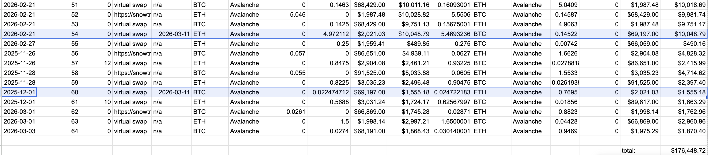

# `virtsz`

Show assets committed to virtual pivots.

* [source](../../quizzes/src/quiz07/b_virtual/mod.rs)

## Revisions

* 2.02, 2026-03-12: Recomputes virtual pivots with today's quotes
* 2.01, 2026-03-11: `--debug`-flag shows context
* 2.00, 2026-03-10: dapp addresses one pool only; shows all virtual pivots
* 1.02, 2026-01-21: moved total_line to libs::reports
* 1.01, 2026-01-21: added app_name and version, improved report-format
* 1.00, 2026-01-15: release

