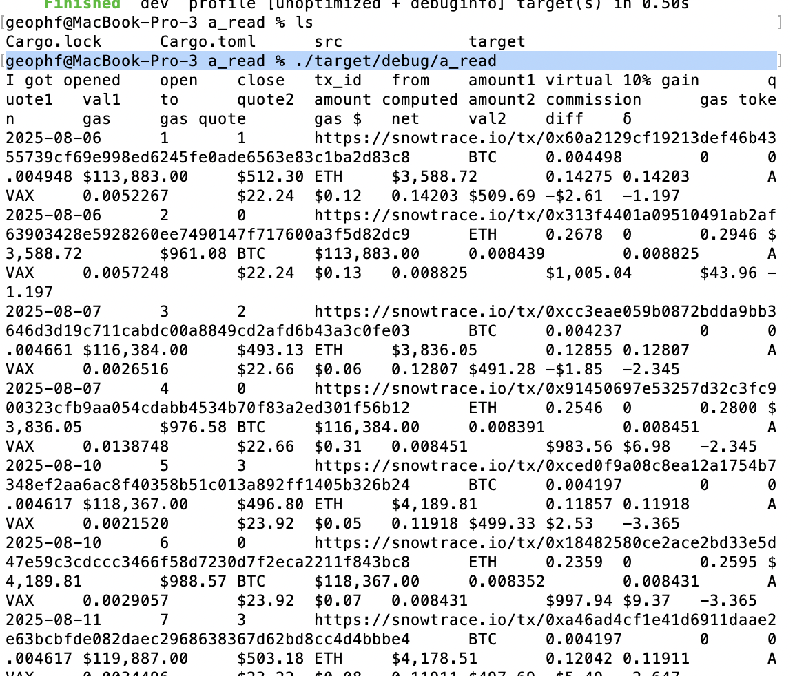

# a_read

Read open pivots from a [REST endpoint](https://raw.githubusercontent.com/pivoteur/pivoteur.github.io/refs/heads/main/data/pivots/open/raw/btc-eth.tsv).

* uses [@logicalgraphs cyrpto-n-rust libraries](https://github.com/logicalgraphs/crypto-n-rust/tree/main/src/libs)

* [solution](src/main.rs)

Voilà
