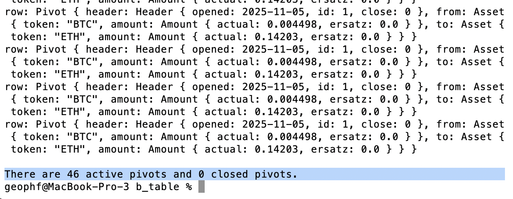
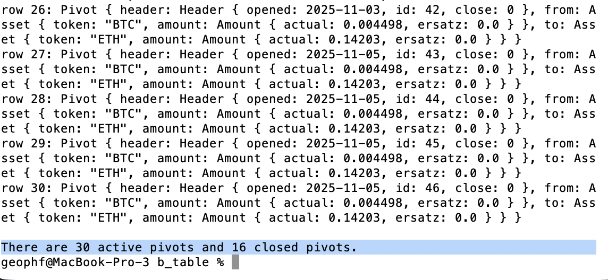

# b_table

Parses raw data from REST endpoint, reifying them to pivots.

* [Problem statement](https://x.com/pivocateur/status/1987968638150738406)
* [Questions on parsed data](https://x.com/pivocateur/status/1987986705459384621)

Step 1: Create Pivot-structures, reify data

* we start by 
<a href="https://github.com/pivoteur/protocol/blob/integrate-opened-dt/quizzes/quiz01/b_table/src/main.rs">parsing
the opened-date</a> into the Pivot-structures.

The result shows pivots with parsed-dates.

* Next we 
<a href="https://github.com/pivoteur/protocol/blob/pivot-header/quizzes/quiz01/b_table/src/main.rs">parse
the entire header</a>.

By parsing the entire header, we now can partition pivots into active and closed
groups, allowing us to focus on open pivots, only.
