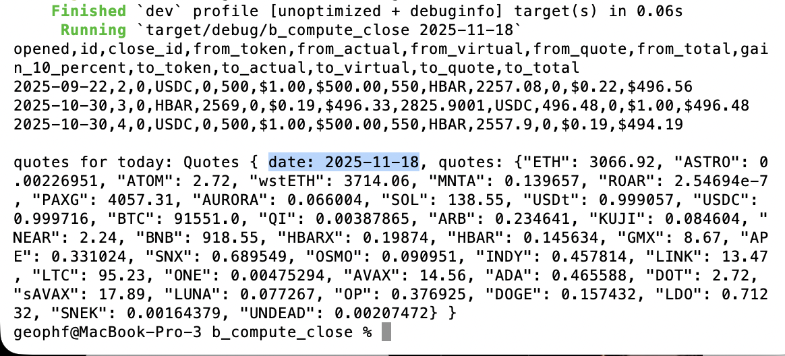
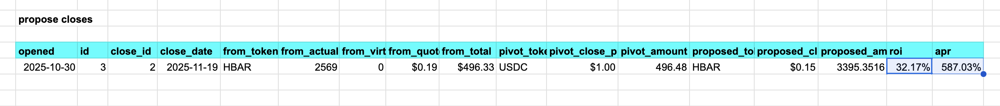
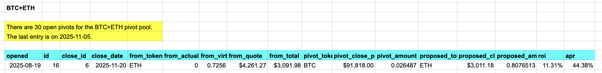

# b_compute_close

Now that we have the [open pivots](../../quiz01) in hand and [today's 
quotes](../a_quotes), now let's simulate what a close pivot would result in,
then, give a go/no-go-signal on the close.

We'll take some steps to get there.

First, let's create a library-call to fetch the open pivots:

* library [fetchers](../../../libs/src/fetchers.rs#L16)

Next, let's fetch today's quotes

* library [fetchers](../../../libs/src/fetchers.rs#L68), again.

... We also embed the date-information with the quotes, as they are dependent
types.

* Now, we make recommendations for close-pivots. This is embedded into the
[Pivot type](../../../libs/src/types/pivots.rs), highlighted by the [`propose`
function](../../../libs/src/types/pivots.rs).

A 32% ROI? Not bad! Not bad! ... but that's only one recommendation. If we look
at the recommendations for BTC+USDC pivot pool, we see the real benefit of
automation:

Here we see 8 close pivot recommendations, provided in an instant.

## Revisions

### checksum

How do I check that the pivots on git reflect the current state of the pivot
pool? 

To this end I have added checksums that allow me quickly to check the 
spreadsheet against the interal working model.

### Percentage gain

Added in the 10% gain amount to delimit a hard go/no-go to a proposed close
pivot.

## Future work

1. This is a pivot-by-pivot recommendation-system. *TODO:* Consolidate 
pivots to one recommendation.
2. We specify each pool, reloading quotes at each pool. *TODO:* 
automatically iterate through all pools.
3. *TODO:* Present an unified amount of each asset on which to close pivots.

The green line consolidates all recommendations for a pool to one close pivot.

