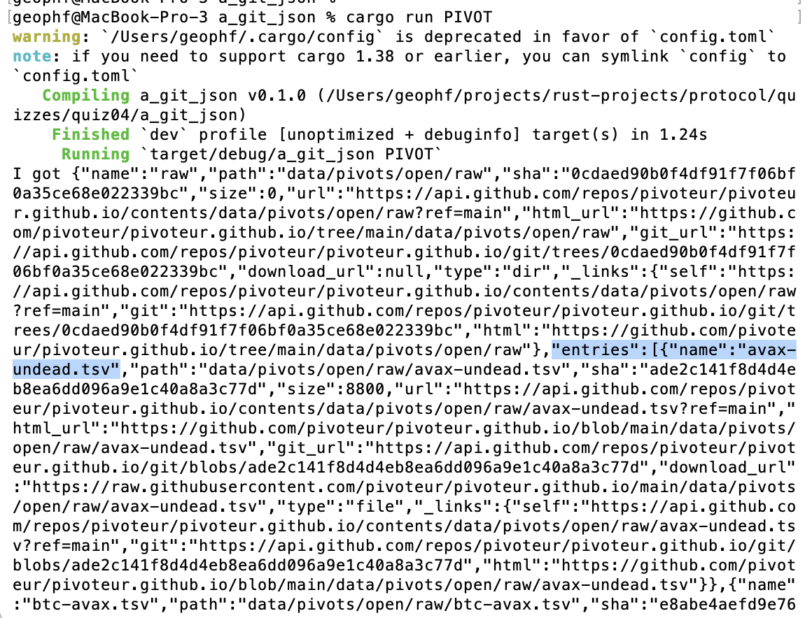

# a_git_json

Okay, the curl-command to fetch git json describing an object is
[here](https://docs.github.com/en/rest/repos/contents?apiVersion=2022-11-28).

It is of the form:

```
curl -L \
  -H "Accept: application/vnd.github.object" \
  -H "Authorization: Bearer <YOUR-TOKEN>" \
  -H "X-GitHub-Api-Version: 2022-11-28" \
  https://api.github.com/repos/OWNER/REPO/contents/PATH
```

If the open pivots are reposed in this directory:

`https://raw.githubusercontent.com/pivoteur/pivoteur.github.io/refs/heads/main/data/pivots/open/raw/`

Then

* `OWNER` is `pivoteur`
* `REPO` is `pivoteur.github.io`
* and `PATH` is `data/pivots/open/raw/`

Let's write a Rust program that queries the git API and gets the directory
information in (spoiler) JSON.

We'll parse the JSON in the next exercise.

> Hint: this isn't a simple fetch, as we need to convey header information,
including your git token.

## Solution

As we didn't have a GET-method that sent header-information, we used duct tape
and good ol' Yankee Elbow-Grease to GIT'r DONE!



You see in the JSON response the names of the pivot pools (highlighted) in the 
open pivots directory.

