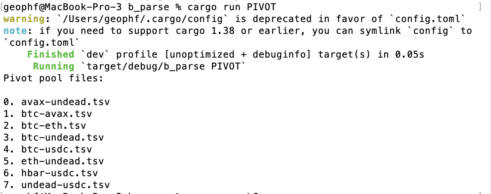

# b_parse

Next step: now that we got JSON ... well, ... y'all know how to PARSE JSON, 
right?

Do that, getting the principal and pivot assets from the directory contents, so:

`"name": "avax-undead.tsv"`

becomes the RUST String-pair:

`("avax", "undead")`

for later processing.

[tweet](https://x.com/pivocateur/status/1996429431267844313)

## Solution

### Part 1: Parsing JSON to get filenames

Using the `serde`-libraries makes parsing JSON simple.

Next, we need to parse the pivot-assets from the filenames.

### Part 2: converting filenames to pivot pool names

As the filenames follow the format:

> `<primary asset>-<pivot asset>.tsv`

Parsing this becomes an exercise in `split()`-ing our way to the solution.

