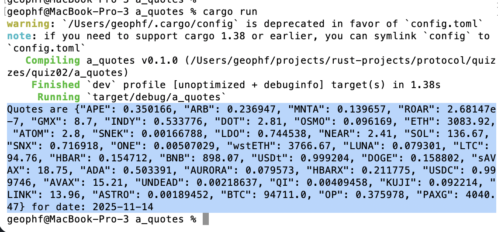

# a_quotes

## Fetch today's quotes from git

Fortunately, I've already done the work of fetching a table from a REST 
endpoint from the previous quiz ([fetch open pivots](../../quiz01)), so I need 
to specialize the previous work to yield a map of tokens to their quotes.

* [answer](src/main.rs)

There's an issue of corruption with the data in the pivots-table? So I do a
work-around by treating the quotes as strings until I need the actual values
in the last row.

